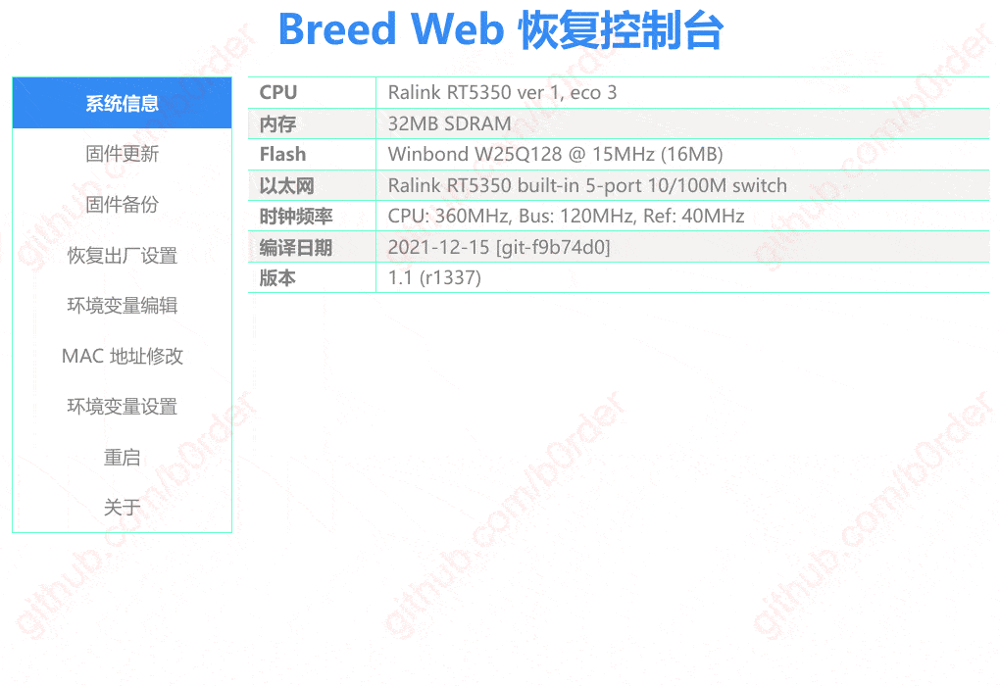

# OpenWrt firmware for A5-V11 mini 3G/3G router with 32M RAM [hardware mod]

This repository contains scripts and **[pre-built firmware](#latest-openwrt-builds)** for popular low-cost [A5-V11 mini 3G/3G router](https://openwrt.org/toh/unbranded/a5-v11) to support 32M RAM:  


| Image file | Description |
| ---------- | ----------- |
| **factory** | if you flash by using the original OEM firmware, the possibly built-in TFTP recovery interface, or some other recovery tool from the original manufacturer. |
| **sysupgrade** | (or trx in past) image is designed to be flashed from OpenWrt/LEDE itself. Either sysupgrade from LuCI or using SSH console. "initramfs" Can be loaded from an arbitrary location ( most often tftp ) and is self-contained in memory. This is like a Linux LiveCD. Often used to test firmware, as the first part of a multi-stage installation or as a recovery tool. |

# Latest OpenWRT builds

<!--versions-table-start-->
| OpenWRT version | OpenWRT release date | A5-V11 OpenWRT Release mod |
| --------------- | -------------------- | -------------------------- |
| [v25.12.0](https://github.com/openwrt/openwrt/tree/v25.12.0) | 2026-03-03T00:16:17Z | v25.12.0 |
| [v24.10.5](https://github.com/openwrt/openwrt/tree/v24.10.5) | [2025-12-18T20:39:34Z](https://github.com/organismus/openwrt-a5_v11/releases/tag/v24.10.5) | v24.10.5 |
| [v23.05.6](https://github.com/openwrt/openwrt/tree/v23.05.6) | [2025-08-15T22:10:50Z](https://github.com/organismus/openwrt-a5_v11/releases/tag/v23.05.6) | v23.05.6 |
| [v22.03.7](https://github.com/openwrt/openwrt/tree/v22.03.7) | [2024-07-22T22:56:37Z](https://github.com/organismus/openwrt-a5_v11/releases/tag/v22.03.7) | **[v22.03.7](https://github.com/organismus/openwrt-a5_v11/releases/tag/v22.03.7)** |
| [v21.02.7](https://github.com/openwrt/openwrt/tree/v21.02.7) | [2023-04-27T21:08:10Z](https://github.com/organismus/openwrt-a5_v11/releases/tag/v21.02.7) | **[v21.02.7](https://github.com/organismus/openwrt-a5_v11/releases/tag/v21.02.7)** |
| [v19.07.9](https://github.com/openwrt/openwrt/tree/v19.07.9) | 2022-02-17T18:43:34Z | v19.07.9 |
| [v18.06.9](https://github.com/openwrt/openwrt/tree/v18.06.9) | 2020-11-17T22:16:57Z | v18.06.9 |
| [v17.01.7](https://github.com/openwrt/openwrt/tree/v17.01.7) | 2019-06-21T12:24:11Z | v17.01.7 |
<!--versions-table-end-->

# Build openwrt manually

Build docker image and compile kernel/packages (for specific version):
```sh
$ docker build -t owrt --build-arg V={OpenWrt TAG} .
```
Examples:
```
$ docker build -t owrt --build-arg V=19.07.10 .
$ docker build -t owrt --build-arg V=21.02.7 .
$ docker build -t owrt --build-arg V=22.03.7 .
$ docker build -t owrt --build-arg V=23.05.4 .
```
List of available OpenWRT tags [here](https://github.com/openwrt/openwrt/tree/v19.07.10).

Run webserver to download compiled kernel/packages:
```
docker run -it -v -p 8081:8080 owrt
```
Files available at http://localhost:8081/bin/targets/ramips/rt305x/

# Hardware mod to increase router memory

Device supplied with internal flash EN25Q32 (4M), but after desoldering 
and replacement it with with W25Q128 (16M) some additional steps required:
1. install bootloader (u-boot)
1. copy 'factory' partition from old flash
1. write new OpenWrt firmware for A5-V11

Assume, you desolder EN25Q32 and can use ch341a flash programmer. Next steps:

## Firmware flash prcedure

### Backup old flash
```bash
$ time flashrom -p ch341a_spi -r ./backup_orig_en25q32.bin
```

### Create blank file 16M filled with FF
```bash
$ dd if=/dev/zero ibs=1M count=16 | tr "\000" "\377" > ./blank16M.bin
```

### Copy nice ‘u-boot’ with [web recovery](#breed-recovery) (during powerup hold reset button)
```bash
$ wget https://breed.hackpascal.net/breed-rt5350-hame-a5.bin
$ dd conv=notrunc if=./breed-rt5350-hame-a5.bin of=/tmp/blank16M.bin
```

### Copy `u-boot-env` partition from original firmware
```bash
$ dd conv=notrunc if=./backup_orig_en25q32.bin of=/tmp/blank16M.bin iflag=skip_bytes,count_bytes bs=$((0x1000)) skip=$((0x30000)) count=$((0x10000)) oflag=seek_bytes seek=$((0x30000))
```

### Copy `factory` partition from original firmware
```bash
$ dd conv=notrunc if=./backup_orig_en25q32.bin of=/tmp/blank16M.bin iflag=skip_bytes,count_bytes bs=$((0x1000)) skip=$((0x40000)) count=$((0x10000)) oflag=seek_bytes seek=$((0x40000))
65+1 records in
65+1 records out
65536 bytes (66 kB, 64 KiB) copied, 0.0013661 s, 48.0 MB/s
```

### Copy prebuilt firmware
```bash
$ dd conv=notrunc if=./openwrt-19.07.10-ramips-rt305x-a5-v11-squashfs-sysupgrade.bin of=/tmp/blank16M.bin bs=$((0x1000)) oflag=seek_bytes seek=$((0x50000))
```

### Write image using CH341 to new flash chip (W25Q128)16M:
```bash
$ time flashrom -p ch341a_spi -w /tmp/blank16M.bin 
flashrom v1.2 on Linux 5.10.0-20-amd64 (x86_64)
flashrom is free software, get the source code at https://flashrom.org

Using clock_gettime for delay loops (clk_id: 1, resolution: 1ns).
Found Winbond flash chip "W25Q128.V" (16384 kB, SPI) on ch341a_spi.
Reading old flash chip contents... done.
Erasing and writing flash chip... Erase/write done.
Verifying flash... VERIFIED.

real	5m5.875s
user	0m48.214s
sys	1m5.172s
```

### Additional useful commands
Get HEX dump in console (show dump n bytes from offset):
```bash
$ xxd -g1 -s $((0x00)) -l $((0x40)) ./backup_orig2_en25q32_ab.bin
00000000: 27 05 19 56 4e 07 bb 56 51 65 8f 0f 00 01 9b e0  '..VN..VQe......
00000010: 80 20 00 00 80 20 00 00 70 5c 7f f5 05 05 01 00  . ... ..p\......
00000020: 53 50 49 20 46 6c 61 73 68 20 49 6d 61 67 65 00  SPI Flash Image.
00000030: 06 50 00 00 00 00 00 00 00 00 00 00 00 00 00 00  .P...........…
```
OR (show dump n bytes from offset):

```
$ hexdump -C -s $((0x0)) -n $((0x40)) ./backup_orig2_en25q32_ab.bin 

00000000  27 05 19 56 4e 07 bb 56  51 65 8f 0f 00 01 9b e0  |'..VN..VQe......|
00000010  80 20 00 00 80 20 00 00  70 5c 7f f5 05 05 01 00  |. ... ..p\......|
00000020  53 50 49 20 46 6c 61 73  68 20 49 6d 61 67 65 00  |SPI Flash Image.|
00000030  06 50 00 00 00 00 00 00  00 00 00 00 00 00 00 00  |.P..............|
00000040
```

### Dump partitions structure (openwrt):
```bash
root@OpenWrt:~# cat /proc/mtd 
dev:    size   erasesize  name
mtd0: 00030000 00001000 "u-boot"
mtd1: 00010000 00001000 "u-boot-env"
mtd2: 00010000 00001000 "factory"
mtd3: 00fb0000 00001000 "firmware"
mtd4: 0012dc77 00001000 "kernel"
mtd5: 00e82389 00001000 "rootfs"
mtd6: 00bbb000 00001000 "rootfs_data"
```

# Breed recovery
In case your device does not boot, you can easily 
reflash firmware from Breed recovery.

To enter recovery mode hold reset button during power on.

Device will light-on blue-red LED (50%).

Then you can plug Ethernet cable, configure static IP address 192.168.1.2 and 
open browser http://192.168.1.1. Additional information you can find [here](https://openwrt.org/docs/techref/bootloader/breed).



# Useful links
- https://github.com/ozayturay/OpenWrt-A5-V11
- https://github.com/mwarning/docker-openwrt-builder

